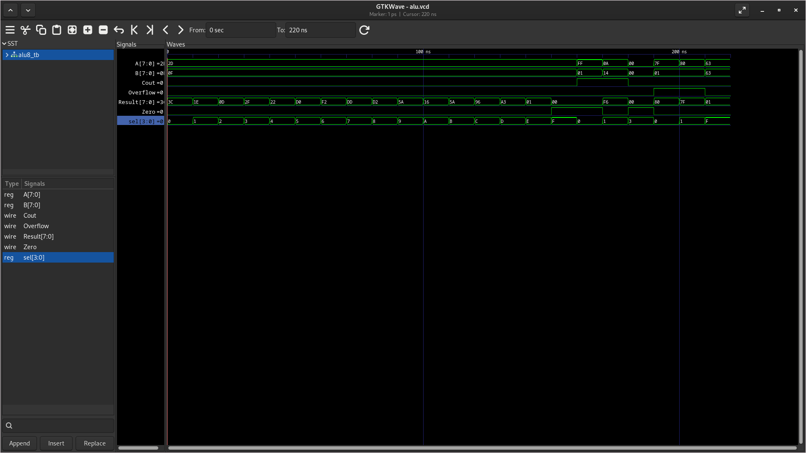

# 8-Bit Arithmetic Logic Unit (ALU) - Verilog & FPGA Implementation

# 8-Bit ALU (Arithmetic Logic Unit)
**Name:** Avi KC
**Roll. no:** 079bct025
**Department:** Electronics, Communication and Information Engineering (BEI)
**Institution:** Pulchowk Campus, Institute of Engineering
**Assignment:** FPGA Laboratory Assignment

---

# 1. Overview

An Arithmetic Logic Unit (ALU) is a fundamental component of digital processors responsible for performing arithmetic calculations and logical operations. This project implements an 8-bit ALU using Verilog Hardware Description Language (HDL). The ALU accepts two 8-bit input operands (`A` and `B`) along with a 4-bit control signal (`sel`) that determines the operation to be executed.

The designed ALU supports sixteen different operations, including arithmetic, logical, shifting, rotating, multiplication, and comparison functions. In addition to the operation result, the ALU generates status flags that provide information about the computation.

The output flags are:

* **Carry Out (Cout):** Indicates carry generation during addition or borrow during subtraction.
* **Zero Flag (Zero):** Becomes logic high when the computed result is zero.
* **Overflow Flag (Overflow):** Indicates signed arithmetic overflow during addition or subtraction operations.

---

# 2. Supported Operations

| Select Input (`sel`) | Operation | Description             | Expression             |
| :------------------: | :-------: | :---------------------- | :--------------------- |
|        `0000`        |    ADD    | Addition                | `A + B`                |
|        `0001`        |    SUB    | Subtraction             | `A - B`                |
|        `0010`        |    AND    | Bitwise AND             | `A & B`                |
|        `0011`        |     OR    | Bitwise OR              | `A \| B`               |
|        `0100`        |    XOR    | Bitwise Exclusive OR    | `A ^ B`                |
|        `0101`        |    NOR    | Bitwise NOR             | `~(A \| B)`            |
|        `0110`        |    NAND   | Bitwise NAND            | `~(A & B)`             |
|        `0111`        |    XNOR   | Bitwise XNOR            | `~(A ^ B)`             |
|        `1000`        |    NOT    | Bitwise Complement      | `~A`                   |
|        `1001`        |    SLL    | Logical Shift Left      | `A << 1`               |
|        `1010`        |    SRL    | Logical Shift Right     | `A >> 1`               |
|        `1011`        |    ROL    | Rotate Left             | `{A[6:0],A[7]}`        |
|        `1100`        |    ROR    | Rotate Right            | `{A[0],A[7:1]}`        |
|        `1101`        |    MUL    | Multiplication          | `A × B` (lower 8 bits) |
|        `1110`        |     GT    | Greater-Than Comparison | `A > B`                |
|        `1111`        |     EQ    | Equality Comparison     | `A == B`               |

---

# 3. Simulation and Verification

The functionality of the ALU was verified using a Verilog testbench (`./ALU_tb.v`). The simulation executes a sequence of test cases covering both standard operations and boundary conditions. Each operation is evaluated with a simulation interval of 10 ns.

## Simulation Waveform



### Analysis of Simulation Results

#### A. Functional Verification (0 ns – 160 ns)

During this interval, all sixteen ALU operations were tested using the input values:

* `A = 45`
* `B = 15`

Some representative results are listed below:

* **Addition (`sel = 0000`)**:

  ```
  45 + 15 = 60 (0x3C)
  ```

* **Subtraction (`sel = 0001`)**:

  ```
  45 - 15 = 30 (0x1E)
  ```

* **Multiplication (`sel = 1101`)**:

  ```
  45 × 15 = 675
  ```

  Since the ALU output width is limited to 8 bits, only the least significant 8 bits are retained:

  ```
  675 mod 256 = 163 (0xA3)
  ```

#### B. Boundary and Special Cases (160 ns – 220 ns)

Several edge conditions were tested to verify the correctness of the status flags.

##### Carry Generation

When:

```
255 + 1
```

the ALU produces:

```
Result = 0
Carry Out = 1
Zero Flag = 1
```

confirming correct carry handling.

##### Subtraction with Borrow

For:

```
10 - 20
```

the result is represented in two's complement form:

```
Result = 246 (0xF6)
```

which corresponds to decimal `-10`.

##### Zero Detection

The operation:

```
0 OR 0
```

produces:

```
Result = 0
Zero Flag = 1
```

demonstrating proper zero detection.

##### Signed Overflow Detection

Two overflow conditions were verified:

1. **Addition Overflow**

```
127 + 1 = 128
```

In signed 8-bit representation, `128` corresponds to `-128`, causing the overflow flag to be asserted.

2. **Subtraction Overflow**

```
-128 - 1
```

produces a positive result due to signed overflow, and the overflow flag is correctly activated.

---

# 4. Simulation Procedure

The ALU design and testbench can be simulated using Icarus Verilog and GTKWave.

### Step 1: Compile the Design

```bash
iverilog -g2012 -o ALU_SIM ALU.v ALU_tb.v
```

### Step 2: Execute the Simulation

```bash
vvp ALU_sim
```

### Step 3: View the Generated Waveform

```bash
gtkwave ./alu.vcd
```

---

# 5. Conclusion

This project successfully demonstrates the design and verification of an 8-bit Arithmetic Logic Unit using Verilog HDL. The ALU supports sixteen different operations and correctly generates the associated status flags. Simulation results confirm that the implemented design behaves correctly under both normal operating conditions and edge-case scenarios, including carry generation, borrow handling, zero detection, and signed overflow detection.

The project provides practical experience in digital circuit design, hardware description languages, simulation methodologies, and FPGA-oriented development workflows.
