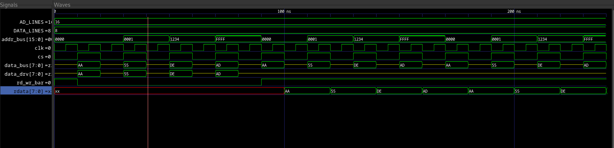

# Control Unit for an 8-Bit Processor – Verilog Implementation

# Control Unit Design and Implementation

**Name:** Avi KC
**Roll No.:** 079BCT025

**Department:** Electronics, Communication and Information Engineering (BEI)

**Institution:** Pulchowk Campus, Institute of Engineering

**Assignment:** FPGA Laboratory Assignment

---

# 1. Overview

The Control Unit is a central component of a processor responsible for coordinating the execution of instructions and generating the appropriate control signals for the datapath components. This project presents the design and implementation of a control unit for an **8-bit processor** using **Verilog/SystemVerilog**.

The implemented control unit operates as a **Moore Finite State Machine (FSM)** consisting of five states. It decodes instructions fetched from memory and generates the required control signals for the register bank, arithmetic logic unit (ALU), and memory subsystem.

The control unit supports the following categories of instructions:

* **SWAP instructions** for exchanging register contents.
* **Arithmetic and Logical instructions** executed through the ALU.
* **Memory operations**, including memory-to-register and register-to-memory transfers.
* **Jump instructions**, both conditional and unconditional.

Instructions are encoded in 8-bit format, while memory and jump operations utilize additional bytes to specify 16-bit addresses.

---

# 2. Supported Instructions

| Opcode Pattern | Instruction | Description                          |
| :------------: | :---------: | :----------------------------------- |
|   `00xxxxxx`   |     SWAP    | Exchange contents of two registers   |
|   `0100xxxx`   |   REG2MEM   | Store register contents into memory  |
|   `0101xxxx`   |   MEM2REG   | Load memory contents into a register |
|   `01100xxx`   |     JMP     | Unconditional jump                   |
|   `011001xx`   |      JC     | Jump if carry flag is set            |
|   `011010xx`   |     JNC     | Jump if carry flag is clear          |
|   `011011xx`   |      JZ     | Jump if zero flag is set             |
|   `011100xx`   |     JNZ     | Jump if zero flag is clear           |
|   `10000xxx`   |     NOP     | No operation                         |
|   `10001xxx`   |     ADD     | Addition                             |
|   `10010xxx`   |     SUB     | Subtraction                          |
|   `10011xxx`   |     INC     | Increment                            |
|   `10100xxx`   |     DEC     | Decrement                            |
|   `10101xxx`   |     COMP    | Bitwise complement                   |
|   `10110xxx`   |    LSHIFT   | Logical left shift                   |
|   `10111xxx`   |    RSHIFT   | Logical right shift                  |
|   `11000xxx`   |   GETFLAG   | Read processor flags                 |
|   `11001xxx`   |   SETFLAG   | Modify processor flags               |
|   `11010xxx`   |     AND     | Bitwise AND                          |
|   `11011xxx`   |      OR     | Bitwise OR                           |
|   `11100xxx`   |     XOR     | Bitwise XOR                          |

---

# 3. Instruction Categories

## A. SWAP Instruction

The SWAP instruction exchanges the contents of two registers.

The instruction fields are:

* `ir[5:3]` – Source register
* `ir[2:0]` – Destination register

During execution, the control unit asserts the swap control signal, allowing the register bank to exchange the contents of the selected registers.

---

## B. Arithmetic and Logical Instructions

Arithmetic and logical operations are executed by the ALU using the accumulator register `R0` and another selected register.

Instruction fields:

* `ir[6:3]` – ALU operation code
* `ir[2:0]` – Selected register

During execution, the control unit:

* Selects `R0` as the first operand.
* Selects the specified register as the second operand.
* Enables ALU output routing.
* Stores the computed result during the STORE state.

Supported operations include:

* ADD
* SUB
* INC
* DEC
* COMP
* LSHIFT
* RSHIFT
* AND
* OR
* XOR
* GETFLAG
* SETFLAG

---

## C. Memory Operations

Memory operations support both loading from memory and storing to memory.

### Memory-to-Register (MEM2REG)

The control unit fetches a 16-bit memory address and loads the corresponding memory value into register `R0`.

### Register-to-Memory (REG2MEM)

The control unit fetches a 16-bit memory address and stores the contents of register `R0` into memory.

The 16-bit address is encoded using two bytes immediately following the instruction:

* First byte: lower 8 bits
* Second byte: upper 8 bits

---

## D. Jump Instructions

Jump instructions modify the program counter and transfer execution to another memory location.

The control unit supports:

* Unconditional Jump (`JMP`)
* Jump if Carry (`JC`)
* Jump if Not Carry (`JNC`)
* Jump if Zero (`JZ`)
* Jump if Not Zero (`JNZ`)

The jump address is stored in two bytes immediately following the instruction.

---

# 4. Finite State Machine

The control unit is implemented using a five-state Moore FSM.

|     State    | Description                                                     |
| :----------: | :-------------------------------------------------------------- |
|    `FETCH`   | Fetch instruction from memory and increment the program counter |
|   `DECODE`   | Decode instruction and determine operation type                 |
| `FETCH_ADDR` | Fetch additional address bytes for memory and jump instructions |
|   `EXECUTE`  | Perform instruction execution                                   |
|    `STORE`   | Store results into memory or registers                          |

The FSM ensures that instructions requiring multiple cycles, such as memory access and jumps, are executed correctly.

---

# 5. Control Signals

The control unit generates the following output signals:

| Signal           | Description                      |
| :--------------- | :------------------------------- |
| `addr_bus`       | Address bus connected to memory  |
| `data_bus`       | Bidirectional processor data bus |
| `mem_cs`         | Memory chip select               |
| `mem_rd_wr_bar`  | Memory read/write control        |
| `reg_sel[1:0]`   | Register selection signals       |
| `reg_alu_db_bar` | Select ALU output or data bus    |
| `reg_rd_wr_bar`  | Register read/write control      |
| `swp`            | Register swap enable             |
| `reg_cs`         | Register bank chip select        |
| `alu_sel`        | ALU operation selector           |

---

# 6. Simulation and Verification

The functionality of the control unit was verified using a SystemVerilog testbench and GTKWave simulation. The simulation validated:

* Instruction fetching and decoding
* Register swapping
* Arithmetic and logical operations
* Memory read and write operations
* Conditional and unconditional jumps
* State transitions of the finite state machine
* Generation of control signals

---

# 7. Simulation Procedure

The control unit and supporting modules can be simulated using **Icarus Verilog** and visualized using **GTKWave**.

### Step 1: Compile the Design

```bash
iverilog -g2012 \
-o cpu_sim \
control_unit.sv \
register_bank.sv \
memory.sv \
alu.v \
8bitadder.v \
shifter.v \
cu_tb.sv
```

### Step 2: Execute the Simulation

```bash
vvp cpu_sim
```

### Step 3: Open the Generated Waveform

```bash
gtkwave control_unit.vcd
```


## Simulation Waveforms




---

# 8. Conclusion

This project successfully demonstrates the design and implementation of a control unit for an 8-bit processor using Verilog/SystemVerilog. The implemented finite state machine correctly handles instruction fetching, decoding, execution, memory access, and program flow control.

Simulation results confirm that the control unit properly generates all required control signals and correctly executes arithmetic, logical, memory, and jump instructions. The project provides practical experience in finite state machine design, processor control logic, hardware description languages, and digital system verification methodologies used in FPGA-based processor development.
