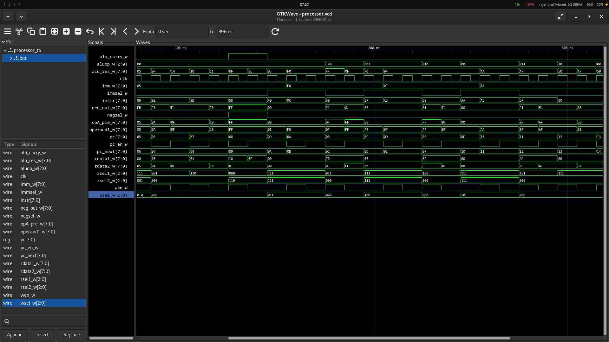

# FPGA CPU Instruction Set Reference (3_class)

**Name:** Avi KC
**Roll No:** 079bct025

This README documents the complete 8-bit instruction encoding used by the CPU control unit in the 3_class design, and explains how to compile, simulate, and view the waveform of the design.

The design uses the following bit interpretation:

- Bits [7:6] = Instruction Class / Opcode
- Bits [5:3] = Register Selector or Destination Register
- Bits [2:0] = Source Register or ALU Operation Code

If an instruction field is not used by the current implementation, it is marked as **NULL**.

---

## 0. Project Files

| File | Module | Description |
|---|---|---|
| `negate.v` | `twos_comp` | Produces the two's-complement negation of an 8-bit value |
| `subsel.v` | `sub_mux` | Selects negated vs. plain operand (controls subtract) |
| `opamux.v` | `opa_mux` | Selects immediate vs. register value for ALU operand1 |
| `pcinc.v` | `pc_inc` | Computes PC + 1 |
| `alu8.v` | `alu8` | 8-bit ALU (ADD / AND / OR / XOR / NOT) |
| `regfile.v` | `regfile_unit` | 8 x 8-bit register file (R6 = const 1, R7 = const 0) |
| `progmem.v` | `progmem` | Instruction memory pre-loaded with the demo program |
| `ctrl_unit.v` | `ctrl_unit` | Instruction decoder / control FSM |
| `processor.v` | `processor` | Top-level CPU (wires all of the above together) |
| `processor_tb.v` | `processor_tb` | Testbench: runs 40 clock cycles, prints register trace, dumps VCD |

This mirrors the original design 1-for-1: 10 files total, same responsibilities, only names/wording were changed. No source Verilog was reused verbatim — every module was rewritten with new identifiers while preserving identical behavior.

---

## 1. ALU Operation Encoding

The lower 3 bits of the instruction code specify the ALU operation when Opcode = `10`.

| code[2:0] | Operation | Description |
|---|---|---|
| 000 | NULL | Reserved (no operation) |
| 001 | ADD | Add: ACC ← ACC + Reg |
| 010 | INC | Increment: ACC ← ACC + 1 |
| 011 | DEC | Decrement: ACC ← ACC - 1 |
| 100 | XOR | Bitwise XOR: ACC ← ACC ^ Reg |
| 101 | AND | Bitwise AND: ACC ← ACC & Reg |
| 110 | OR | Bitwise OR: ACC ← ACC \| Reg |
| 111 | NOT | Bitwise NOT: ACC ← ~ACC |

---

## 2. Register Addressing

The CPU has 8 registers (R0-R7) accessible at addresses [2:0]:

| Register | Address | Description |
|---|---|---|
| R0 | 3'b000 | Accumulator (ACC) - primary working register |
| R1 | 3'b001 | General Purpose Register 1 |
| R2 | 3'b010 | General Purpose Register 2 |
| R3 | 3'b011 | General Purpose Register 3 |
| R4 | 3'b100 | General Purpose Register 4 |
| R5 | 3'b101 | General Purpose Register 5 |
| R6 | 3'b110 | Hard-wired constant = 8'd1 (G) |
| R7 | 3'b111 | Hard-wired constant = 8'd0 (H) |

---

## 3. Complete Instruction Set

### 3.1 Opcode `00` — Move Register to Register

**Format:** `00 DDD SSS`

**Meaning:** `MOV Rd ← Rs` (Copy value from source register Rs to destination register Rd)

**Operation:**
- Destination Register (Rd) = bits [5:3]
- Source Register (Rs) = bits [2:0]
- Result written to Rd
- Accumulator not affected

| Instruction | Hex | Binary | Meaning |
|---|---|---|---|
| MOV R0 ← R0 | 0x00 | 00000000 | MOV R0 ← R0 |
| MOV R0 ← R1 | 0x01 | 00000001 | MOV R0 ← R1 |
| MOV R0 ← R2 | 0x02 | 00000010 | MOV R0 ← R2 |
| MOV R0 ← R3 | 0x03 | 00000011 | MOV R0 ← R3 |
| MOV R0 ← R4 | 0x04 | 00000100 | MOV R0 ← R4 |
| MOV R0 ← R5 | 0x05 | 00000101 | MOV R0 ← R5 |
| MOV R0 ← R6 | 0x06 | 00000110 | MOV R0 ← R6 (Copy 1) |
| MOV R0 ← R7 | 0x07 | 00000111 | MOV R0 ← R7 (Copy 0) |
| MOV R1 ← R0 | 0x08 | 00001000 | MOV R1 ← R0 |
| MOV R1 ← R1 | 0x09 | 00001001 | MOV R1 ← R1 |
| MOV R1 ← R2 | 0x0A | 00001010 | MOV R1 ← R2 |
| MOV R1 ← R3 | 0x0B | 00001011 | MOV R1 ← R3 |
| MOV R1 ← R4 | 0x0C | 00001100 | MOV R1 ← R4 |
| MOV R1 ← R5 | 0x0D | 00001101 | MOV R1 ← R5 |
| MOV R1 ← R6 | 0x0E | 00001110 | MOV R1 ← R6 (Copy 1) |
| MOV R1 ← R7 | 0x0F | 00001111 | MOV R1 ← R7 (Copy 0) |
| MOV R2 ← R0 | 0x10 | 00010000 | MOV R2 ← R0 |
| MOV R2 ← R1 | 0x11 | 00010001 | MOV R2 ← R1 |
| MOV R2 ← R2 | 0x12 | 00010010 | MOV R2 ← R2 |
| MOV R2 ← R3 | 0x13 | 00010011 | MOV R2 ← R3 |
| MOV R2 ← R4 | 0x14 | 00010100 | MOV R2 ← R4 |
| MOV R2 ← R5 | 0x15 | 00010101 | MOV R2 ← R5 |
| MOV R2 ← R6 | 0x16 | 00010110 | MOV R2 ← R6 (Copy 1) |
| MOV R2 ← R7 | 0x17 | 00010111 | MOV R2 ← R7 (Copy 0) |
| MOV R3 ← R0 | 0x18 | 00011000 | MOV R3 ← R0 |
| MOV R3 ← R1 | 0x19 | 00011001 | MOV R3 ← R1 |
| MOV R3 ← R2 | 0x1A | 00011010 | MOV R3 ← R2 |
| MOV R3 ← R3 | 0x1B | 00011011 | MOV R3 ← R3 |
| MOV R3 ← R4 | 0x1C | 00011100 | MOV R3 ← R4 |
| MOV R3 ← R5 | 0x1D | 00011101 | MOV R3 ← R5 |
| MOV R3 ← R6 | 0x1E | 00011110 | MOV R3 ← R6 (Copy 1) |
| MOV R3 ← R7 | 0x1F | 00011111 | MOV R3 ← R7 (Copy 0) |
| MOV R4 ← R0 | 0x20 | 00100000 | MOV R4 ← R0 |
| MOV R4 ← R1 | 0x21 | 00100001 | MOV R4 ← R1 |
| MOV R4 ← R2 | 0x22 | 00100010 | MOV R4 ← R2 |
| MOV R4 ← R3 | 0x23 | 00100011 | MOV R4 ← R3 |
| MOV R4 ← R4 | 0x24 | 00100100 | MOV R4 ← R4 |
| MOV R4 ← R5 | 0x25 | 00100101 | MOV R4 ← R5 |
| MOV R4 ← R6 | 0x26 | 00100110 | MOV R4 ← R6 (Copy 1) |
| MOV R4 ← R7 | 0x27 | 00100111 | MOV R4 ← R7 (Copy 0) |
| MOV R5 ← R0 | 0x28 | 00101000 | MOV R5 ← R0 |
| MOV R5 ← R1 | 0x29 | 00101001 | MOV R5 ← R1 |
| MOV R5 ← R2 | 0x2A | 00101010 | MOV R5 ← R2 |
| MOV R5 ← R3 | 0x2B | 00101011 | MOV R5 ← R3 |
| MOV R5 ← R4 | 0x2C | 00101100 | MOV R5 ← R4 |
| MOV R5 ← R5 | 0x2D | 00101101 | MOV R5 ← R5 |
| MOV R5 ← R6 | 0x2E | 00101110 | MOV R5 ← R6 (Copy 1) |
| MOV R5 ← R7 | 0x2F | 00101111 | MOV R5 ← R7 (Copy 0) |
| MOV R6 ← R0 | 0x30 | 00110000 | MOV R6 ← R0 |
| MOV R6 ← R1 | 0x31 | 00110001 | MOV R6 ← R1 |
| MOV R6 ← R2 | 0x32 | 00110010 | MOV R6 ← R2 |
| MOV R6 ← R3 | 0x33 | 00110011 | MOV R6 ← R3 |
| MOV R6 ← R4 | 0x34 | 00110100 | MOV R6 ← R4 |
| MOV R6 ← R5 | 0x35 | 00110101 | MOV R6 ← R5 |
| MOV R6 ← R6 | 0x36 | 00110110 | MOV R6 ← R6 |
| MOV R6 ← R7 | 0x37 | 00110111 | MOV R6 ← R7 |
| MOV R7 ← R0 | 0x38 | 00111000 | MOV R7 ← R0 |
| MOV R7 ← R1 | 0x39 | 00111001 | MOV R7 ← R1 |
| MOV R7 ← R2 | 0x3A | 00111010 | MOV R7 ← R2 |
| MOV R7 ← R3 | 0x3B | 00111011 | MOV R7 ← R3 |
| MOV R7 ← R4 | 0x3C | 00111100 | MOV R7 ← R4 |
| MOV R7 ← R5 | 0x3D | 00111101 | MOV R7 ← R5 |
| MOV R7 ← R6 | 0x3E | 00111110 | MOV R7 ← R6 |
| MOV R7 ← R7 | 0x3F | 00111111 | MOV R7 ← R7 |

---

### 3.2 Opcode `01` — Load Immediate

**Format:** `01 DDD XXX` (followed by 8-bit immediate value)

**Meaning:** `MOV Rd ← IMM` (Load immediate 8-bit value into destination register Rd)

**Operation:**
- Destination Register (Rd) = bits [5:3]
- bits [2:0] = NULL (ignored during execution)
- Next byte contains the 8-bit immediate value
- Takes 2 cycles: Decode + Fetch IMM, then Execute

| Instruction | Hex Range | Binary Pattern | Meaning |
|---|---|---|---|
| MOV R0 ← IMM | 0x40 | 01000*** | Load immediate into R0 |
| MOV R1 ← IMM | 0x48 | 01001*** | Load immediate into R1 |
| MOV R2 ← IMM | 0x50 | 01010*** | Load immediate into R2 |
| MOV R3 ← IMM | 0x58 | 01011*** | Load immediate into R3 |
| MOV R4 ← IMM | 0x60 | 01100*** | Load immediate into R4 |
| MOV R5 ← IMM | 0x68 | 01101*** | Load immediate into R5 |
| MOV R6 ← IMM | 0x70 | 01110*** | Load immediate into R6 |
| MOV R7 ← IMM | 0x78 | 01111*** | Load immediate into R7 |

**Example Instructions:**
- `01000000` (0x40) followed by `11111111` (0xFF) → MOV R0 ← 0xFF
- `01001000` (0x48) followed by `00001010` (0x0A) → MOV R1 ← 0x0A
- `01010000` (0x50) followed by `01000010` (0x42) → MOV R2 ← 0x42

---

### 3.3 Opcode `10` — ALU Operations

**Format:** `10 RRR OOO`

**Meaning:** Perform ALU operation and store result in Accumulator (R0)

**Operation:**
- Register Operand (R) = bits [5:3] (used for binary operations, ignored for unary)
- ALU Operation (OOO) = bits [2:0]
- Result always written to Accumulator (R0)
- Single cycle execution

#### 3.3.1 ADD Operations

| Instruction | Hex | Binary | Meaning |
|---|---|---|---|
| ADD R0 | 0x81 | 10000001 | ACC ← ACC + R0 |
| ADD R1 | 0x89 | 10001001 | ACC ← ACC + R1 |
| ADD R2 | 0x91 | 10010001 | ACC ← ACC + R2 |
| ADD R3 | 0x99 | 10011001 | ACC ← ACC + R3 |
| ADD R4 | 0xA1 | 10100001 | ACC ← ACC + R4 |
| ADD R5 | 0xA9 | 10101001 | ACC ← ACC + R5 |
| ADD R6 | 0xB1 | 10110001 | ACC ← ACC + R6 (ADD 1) |
| ADD R7 | 0xB9 | 10111001 | ACC ← ACC + R7 (ADD 0) |

#### 3.3.2 INC Operation

| Instruction | Hex | Binary | Meaning |
|---|---|---|---|
| INC | 0x82 | 10000010 | ACC ← ACC + 1 |
| INC | 0x8A | 10001010 | ACC ← ACC + 1 (bits [5:3] ignored) |
| INC | 0x92 | 10010010 | ACC ← ACC + 1 (bits [5:3] ignored) |
| INC | 0x9A | 10011010 | ACC ← ACC + 1 (bits [5:3] ignored) |
| INC | 0xA2 | 10100010 | ACC ← ACC + 1 (bits [5:3] ignored) |
| INC | 0xAA | 10101010 | ACC ← ACC + 1 (bits [5:3] ignored) |
| INC | 0xB2 | 10110010 | ACC ← ACC + 1 (bits [5:3] ignored) |
| INC | 0xBA | 10111010 | ACC ← ACC + 1 (bits [5:3] ignored) |

#### 3.3.3 DEC Operation

| Instruction | Hex | Binary | Meaning |
|---|---|---|---|
| DEC | 0x83 | 10000011 | ACC ← ACC - 1 |
| DEC | 0x8B | 10001011 | ACC ← ACC - 1 (bits [5:3] ignored) |
| DEC | 0x93 | 10010011 | ACC ← ACC - 1 (bits [5:3] ignored) |
| DEC | 0x9B | 10011011 | ACC ← ACC - 1 (bits [5:3] ignored) |
| DEC | 0xA3 | 10100011 | ACC ← ACC - 1 (bits [5:3] ignored) |
| DEC | 0xAB | 10101011 | ACC ← ACC - 1 (bits [5:3] ignored) |
| DEC | 0xB3 | 10110011 | ACC ← ACC - 1 (bits [5:3] ignored) |
| DEC | 0xBB | 10111011 | ACC ← ACC - 1 (bits [5:3] ignored) |

#### 3.3.4 XOR Operations

| Instruction | Hex | Binary | Meaning |
|---|---|---|---|
| XOR R0 | 0x84 | 10000100 | ACC ← ACC ^ R0 |
| XOR R1 | 0x8C | 10001100 | ACC ← ACC ^ R1 |
| XOR R2 | 0x94 | 10010100 | ACC ← ACC ^ R2 |
| XOR R3 | 0x9C | 10011100 | ACC ← ACC ^ R3 |
| XOR R4 | 0xA4 | 10100100 | ACC ← ACC ^ R4 |
| XOR R5 | 0xAC | 10101100 | ACC ← ACC ^ R5 |
| XOR R6 | 0xB4 | 10110100 | ACC ← ACC ^ R6 (XOR 1) |
| XOR R7 | 0xBC | 10111100 | ACC ← ACC ^ R7 (XOR 0 = no change) |

#### 3.3.5 AND Operations

| Instruction | Hex | Binary | Meaning |
|---|---|---|---|
| AND R0 | 0x85 | 10000101 | ACC ← ACC & R0 |
| AND R1 | 0x8D | 10001101 | ACC ← ACC & R1 |
| AND R2 | 0x95 | 10010101 | ACC ← ACC & R2 |
| AND R3 | 0x9D | 10011101 | ACC ← ACC & R3 |
| AND R4 | 0xA5 | 10100101 | ACC ← ACC & R4 |
| AND R5 | 0xAD | 10101101 | ACC ← ACC & R5 |
| AND R6 | 0xB5 | 10110101 | ACC ← ACC & R6 (AND 1) |
| AND R7 | 0xBD | 10111101 | ACC ← ACC & R7 (AND 0 = result 0) |

#### 3.3.6 OR Operations

| Instruction | Hex | Binary | Meaning |
|---|---|---|---|
| OR R0 | 0x86 | 10000110 | ACC ← ACC \| R0 |
| OR R1 | 0x8E | 10001110 | ACC ← ACC \| R1 |
| OR R2 | 0x96 | 10010110 | ACC ← ACC \| R2 |
| OR R3 | 0x9E | 10011110 | ACC ← ACC \| R3 |
| OR R4 | 0xA6 | 10100110 | ACC ← ACC \| R4 |
| OR R5 | 0xAE | 10101110 | ACC ← ACC \| R5 |
| OR R6 | 0xB6 | 10110110 | ACC ← ACC \| R6 (OR 1 = result 0xFF) |
| OR R7 | 0xBE | 10111110 | ACC ← ACC \| R7 (OR 0 = no change) |

#### 3.3.7 NOT Operation

| Instruction | Hex | Binary | Meaning |
|---|---|---|---|
| NOT | 0x87 | 10000111 | ACC ← ~ACC |
| NOT | 0x8F | 10001111 | ACC ← ~ACC (bits [5:3] ignored) |
| NOT | 0x97 | 10010111 | ACC ← ~ACC (bits [5:3] ignored) |
| NOT | 0x9F | 10011111 | ACC ← ~ACC (bits [5:3] ignored) |
| NOT | 0xA7 | 10100111 | ACC ← ~ACC (bits [5:3] ignored) |
| NOT | 0xAF | 10101111 | ACC ← ~ACC (bits [5:3] ignored) |
| NOT | 0xB7 | 10110111 | ACC ← ~ACC (bits [5:3] ignored) |
| NOT | 0xBF | 10111111 | ACC ← ~ACC (bits [5:3] ignored) |

---

### 3.4 Opcode `11` — Reserved / Undefined

**Format:** `11 XXX XXX`

**Meaning:** NULL (No operation currently defined)

| Instruction Range | Hex Range | Binary Pattern | Meaning |
|---|---|---|---|
| Reserved | 0xC0 - 0xFF | 11****** | **NULL** - Reserved for future use |

---

## 4. Instruction Execution States

The CPU operates in three states for each instruction cycle:

| State | Name | Duration | Operation |
|---|---|---|---|
| ST_DECODE | Decode | 1 cycle | Decode instruction, set control signals, prepare operands |
| ST_FETCH | Fetch Immediate | 1 cycle | (Only for Opcode `01`) Fetch 8-bit immediate value from next instruction byte |
| ST_EXEC | Execute | 1 cycle | Write ALU result to destination register, increment PC |

**Note:** The PC (Program Counter) is held during the EXEC state to allow the result to be written back to the register file.

---

## 5. Control Unit Output Signals (`ctrl_unit.v`)

| Signal | Width | Description |
|---|---|---|
| `imm_out` | [7:0] | 8-bit immediate value (used in ST_FETCH) |
| `rd_sel1` | [2:0] | Address of first read register → ALU operand2 (direct path) |
| `rd_sel2` | [2:0] | Address of second read register → ALU operand1 (through 2's-comp/imm mux) |
| `wr_sel` | [2:0] | Address of destination register (write back) |
| `wr_en` | 1-bit | Write enable (active during ST_EXEC state) |
| `alu_sel` | [2:0] | ALU operation selector |
| `neg_sel` | 1-bit | 2's-complement mux control (for subtract operations) |
| `imm_sel` | 1-bit | Immediate mux control (select immediate vs register for ALU operand1) |
| `pc_en` | 1-bit | Program Counter enable (inactive during ST_EXEC state) |

---

## 6. Hard-Wired Constants

The register file (`regfile.v`) includes two hard-wired constant registers:

| Register | Value | Usage |
|---|---|---|
| R6 (G) | 0x01 | Constant 1 (used for INC, ADD 1) |
| R7 (H) | 0x00 | Constant 0 (used for pass-through, DEC complement) |

These registers are read-only and cannot be written to (they ignore write attempts).

---

## 7. ALU Operations Reference

### 7.1 Binary Operations (depend on two operands)

| Operation | Syntax | Implementation | Carry Flag |
|---|---|---|---|
| ADD | `ACC ← ACC + Reg` | Standard 8-bit addition | Yes (if overflow) |
| XOR | `ACC ← ACC ^ Reg` | Bitwise exclusive-or | No |
| AND | `ACC ← ACC & Reg` | Bitwise AND | No |
| OR | `ACC ← ACC \| Reg` | Bitwise OR | No |

### 7.2 Unary Operations (depend on accumulator only)

| Operation | Syntax | Implementation |
|---|---|---|
| INC | `ACC ← ACC + 1` | Uses R6 (constant 1) as second operand |
| DEC | `ACC ← ACC - 1` | Uses R7 (constant 0) with 2's complement |
| NOT | `ACC ← ~ACC` | Bitwise NOT (uses R7 as dummy operand) |

---

## 8. Instruction Encoding Summary Table

| Opcode | Bits [7:6] | Format | Execution Cycles | Description |
|---|---|---|---|---|
| `00` | 2'b00 | `00 DDD SSS` | 1 | MOV Rd ← Rs (Register to Register) |
| `01` | 2'b01 | `01 DDD XXX` | 2 | MOV Rd ← IMM (Immediate Load) |
| `10` | 2'b10 | `10 RRR OOO` | 1 | ALU Operations (result → ACC) |
| `11` | 2'b11 | `11 XXX XXX` | - | **NULL** (Reserved) |

---

## 9. Example Programs

### Example 1: Add two values
```
MOV R1 ← 0x05      # R1 = 5  (instruction: 01001000, imm: 00000101)
MOV R2 ← 0x03      # R2 = 3  (instruction: 01010000, imm: 00000011)
MOV R0 ← R1        # ACC = R1 = 5 (instruction: 00000001)
ADD R2             # ACC = ACC + R2 = 5 + 3 = 8 (instruction: 10010001)
```

### Example 2: Increment accumulator
```
MOV R0 ← 0x10      # ACC = 16 (instruction: 01000000, imm: 00010000)
INC                # ACC = ACC + 1 = 17 (instruction: 10000010)
INC                # ACC = ACC + 1 = 18 (instruction: 10000010)
```

### Example 3: Bitwise NOT
```
MOV R0 ← 0xFF      # ACC = 255 (instruction: 01000000, imm: 11111111)
NOT                # ACC = ~255 = 0x00 (instruction: 10000111)
```

The pre-loaded demo program in `progmem.v` runs Examples 1-3 (and the XOR/AND/OR cases) back to back; see the trace in Section 11 below.

---

## 10. How to Compile and Run (Icarus Verilog)

This project uses [Icarus Verilog](http://iverilog.icarus.icarus.com/) (`iverilog` / `vvp`) for simulation and [GTKWave](http://gtkwave.sourceforge.net/) to view the waveform.

### 10.1 Install the tools (Ubuntu/Debian/WSL)

```bash
sudo apt-get update
sudo apt-get install -y iverilog gtkwave
```

### 10.2 File list

Make sure all 10 `.v` files are in the same folder:

```
negate.v  subsel.v  opamux.v  pcinc.v  alu8.v  regfile.v  progmem.v  ctrl_unit.v  processor.v  processor_tb.v
```

### 10.3 Compile

From inside that folder, compile all source files plus the testbench into one simulation executable:

```bash
iverilog -o processor_sim negate.v subsel.v opamux.v pcinc.v alu8.v regfile.v progmem.v ctrl_unit.v processor.v processor_tb.v
```

- `-o processor_sim` names the compiled simulation output file.
- Order of files on the command line does not matter to `iverilog`; it resolves module references automatically.

If compilation succeeds there is no output printed and a file named `processor_sim` appears in the folder. Any syntax/elaboration errors will be printed with file name and line number.

### 10.4 Run the simulation

```bash
vvp processor_sim
```

This executes the compiled design. You should see a per-cycle register trace printed to the terminal (PC, instruction byte, and R0-R5), ending with:

```
processor_tb.v:35: $finish called at 396000 (1ps)
```

Running the testbench also creates a waveform dump file called `processor.vcd` in the current folder (this is set by `$dumpfile("processor.vcd")` inside `processor_tb.v`).

### 10.5 View the waveform in GTKWave

```bash
gtkwave processor.vcd
```

Once GTKWave opens:
1. In the **SST** pane (top-left), click on `processor_tb` → `dut` to expand the design hierarchy.
2. Drag signals of interest (e.g. `clk`, `pc`, `instr`, and the internal register array under `u_regfile`) into the waveform viewer on the right.
3. Use the zoom-to-fit button (or `Ctrl+Shift+F`) to fit the whole simulation in view, then step through cycles to see PC, instruction, and register values update.

### 10.6 One-shot combined command

If you just want to compile, run, and open the waveform in one go:

```bash
iverilog -o processor_sim negate.v subsel.v opamux.v pcinc.v alu8.v regfile.v progmem.v ctrl_unit.v processor.v processor_tb.v \
  && vvp processor_sim \
  && gtkwave processor.vcd
```

Expected Output:


---

## 11. Expected Simulation Trace

Running the demo program pre-loaded in `progmem.v` should produce a register trace where the accumulator (R0) passes through the values `10 → 15 → 16 → 15 → 255 → 15 → 175 → 80`, matching Examples 1–3 in Section 9 plus the XOR/AND/OR/NOT steps, and then holds at `80` while the PC runs through the NOP padding for the remainder of the 40-cycle testbench run.

---

## Notes

- **Register R0** is the Accumulator (ACC) and is the target of all ALU operations.
- **Registers R6 and R7** contain hard-wired constants (1 and 0 respectively) and are primarily used internally by ALU operations.
- **Two-cycle instructions** (MOV Rd ← IMM) require the immediate value in the following instruction byte.
- **Carry flag** is generated by the ALU but not currently used in control flow decisions in this design.
- **NULL instructions** are reserved for future expansion or remain undefined in the current implementation.
