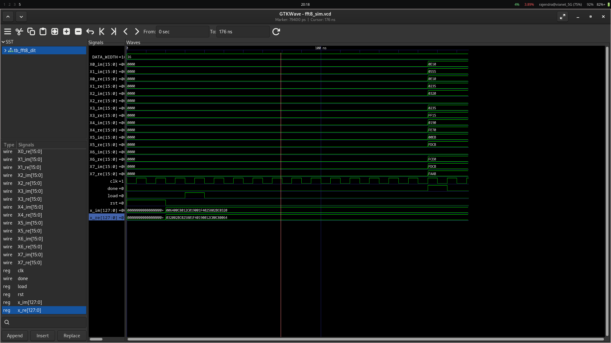

# FFT Implementation Assignment
## Name: Avi KC
### Roll no: 079BCT025

# 8-Point FFT in Verilog

**Radix-2 Decimation-in-Time (DIT) FFT**

A compact RTL implementation of an 8-point complex Fast Fourier Transform, written in Verilog and verified with an Icarus Verilog testbench.

---

## Project Overview

This project implements an **8-point radix-2 DIT FFT** for complex-valued input samples.

The design:

- accepts 8 real and 8 imaginary input samples through packed buses;
- rearranges the samples using **3-bit bit reversal**;
- evaluates the FFT through three butterfly stages;
- uses fixed-point **Q15** representation for the non-trivial twiddle factors;
- exposes the eight complex frequency-domain outputs;
- provides a `done` signal when the result is available;
- generates a VCD waveform that can be inspected in GTKWave.

### Input used for verification

The testbench uses

\[
x[n] = 100(n+1) + j\,100(8-n), \qquad 0 \le n < 8
\]

which gives:

```text
x[0] = 100 + j800
x[1] = 200 + j700
x[2] = 300 + j600
x[3] = 400 + j500
x[4] = 500 + j400
x[5] = 600 + j300
x[6] = 700 + j200
x[7] = 800 + j100
```

---

## Repository Layout

```text
.
├── fft8_dit.v          # FFT RTL design
├── tb_fft8_dit.v       # Simulation testbench
├── fft8_sim            # Compiled Icarus Verilog simulation
├── fft8_sim.vcd        # Generated waveform
├── sim.png             # Example waveform screenshot
└── README.md           # Project documentation
```

---

## Requirements

- **Icarus Verilog** (`iverilog` / `vvp`)
- **GTKWave** (optional, for waveform inspection)

---

## Build and Run

From the project directory:

### 1. Compile the RTL and testbench

```bash
iverilog -g2012 -o fft8_sim fft8_dit.v tb_fft8_dit.v
```

### 2. Run the simulation

```bash
vvp fft8_sim
```

```text
==============================================
          8-POINT DIT FFT RESULTS
==============================================
Input: x[n] = 100(n+1) + j*100(8-n)
----------------------------------------------
X[0] =   3600 + j(  3600)
X[1] =     -1 + j(   799)
X[2] =      0 + j(   800)
X[3] =   -801 + j(    -1)
X[4] =   -400 + j(   400)
X[5] =      1 + j(   801)
X[6] =   -800 + j(     0)
X[7] =   -799 + j(     1)
----------------------------------------------
FFT completed successfully.
==============================================
```

---

## View the Waveform

The testbench automatically creates:

```text
fft8_sim.vcd
```

Open it with:

```bash
gtkwave fft8_sim.vcd
```



Useful signals to inspect include:

```text
clk
rst
load
done

x_re
x_im

X0_re X0_im
X1_re X1_im
X2_re X2_im
X3_re X3_im
X4_re X4_im
X5_re X5_im
X6_re X6_im
X7_re X7_im
```

The waveform should show the input being loaded first, followed by the three FFT stages and the final output values when `done` becomes high.

---

## FFT Datapath

The implementation follows the standard 8-point radix-2 DIT structure:

```text
Input samples
     │
     ▼
Bit-reversal
     │
     ▼
Stage 1
(distance = 1)
     │
     ▼
Stage 2
(distance = 2)
     │
     ▼
Stage 3
(distance = 4)
     │
     ▼
X[0] ... X[7]
```

The non-trivial twiddle factor is represented by:

```text
0.70710678 × 2^15 ≈ 23170
```

so the design can perform the required multiplications using integer arithmetic and an arithmetic right shift.

---

## Control Flow

The FFT controller moves through these states:

```text
IDLE
  ↓
LOAD
  ↓
STAGE1
  ↓
STAGE2
  ↓
STAGE3
  ↓
DONE
  ↓
IDLE
```

`load` starts a new transform. `done` indicates that the eight output registers contain the completed FFT result.

---
