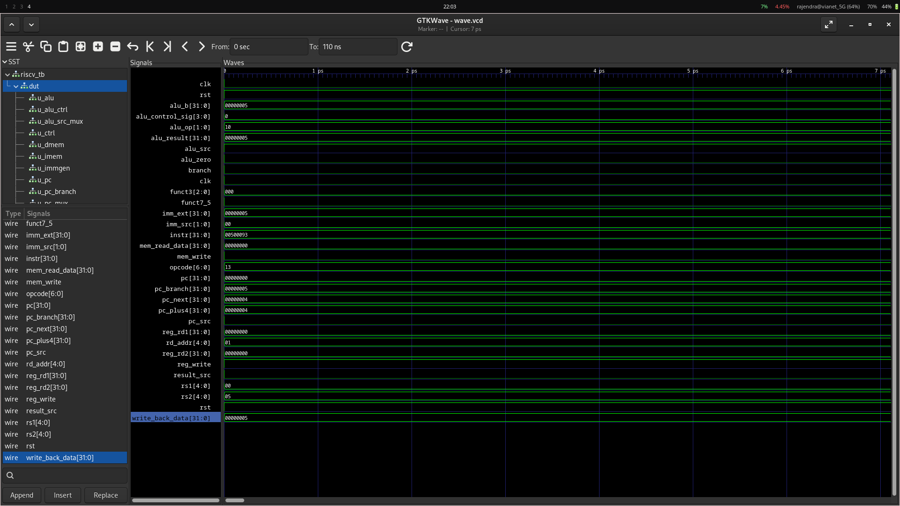

# Single-Cycle RISC-V Processor

**Name:** Avi KC
**Roll No.:** 079BCT025

**Department:** Electronics, Communication and Information Engineering (BEI)

**Institution:** Pulchowk Campus, Institute of Engineering


This project implements a basic **32-bit single-cycle RISC-V (RV32I) processor** in Verilog. The datapath includes the program counter, instruction and data memories, register file, immediate generator, control unit, ALU, adders, and multiplexers.

The processor currently supports common R-type and I-type ALU instructions, `lw`, `sw`, and conditional branch decoding.

## Test program

`riscv_tb.v` loads and executes this short program:

```asm
addi x1, x0, 5
addi x2, x0, 10
add  x3, x1, x2
sw   x3, 0(x0)
lw   x4, 0(x0)
```

The expected final values are `x1 = 5`, `x2 = 10`, `x3 = 15`, `x4 = 15`, and `mem[0] = 15`.

## Run the simulation

Install Icarus Verilog and GTKWave, then run:

```bash
iverilog -o risc-sim *.v
vvp risc-sim
gtkwave wave.vcd
```

The testbench generates `wave.vcd` for waveform inspection. Important signals include `pc`, `instr`, `alu_result`, `reg_write`, `mem_write`, and `write_back_data`.

## GTKWave result

The waveform shows the program counter advancing through the instructions and the datapath control/data signals changing for the ADDI, ADD, store, and load operations.


